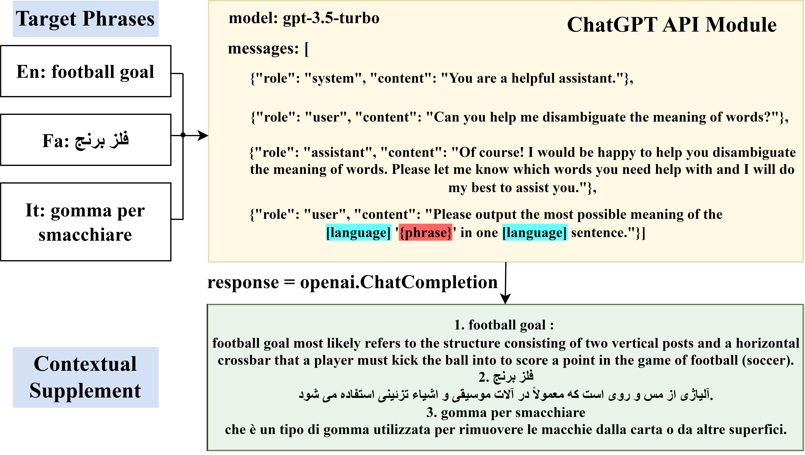

## MTA: A Lightweight Multilingual Text Alignment Model for Cross-language Visual Word Sense Disambiguation
Visual Word Sense Disambiguation (Visual-WSD), as a subtask of fine-grained image-text retrieval, requires a high level of language-vision understanding to capture and exploit the nuanced relationships between text and visual features. However, the cross-linguistic background only with limited contextual information and the subtle differences between multimodal representations are considered the most significant challenges for this task. In this paper, we propose MTA, which employs a new approach for multilingual contrastive learning with self-distillation to align fine-grained textual features to fixed vision features and align non-English textual features to English textual momentum features. It is a lightweight and end-to-end model since it does not require updating the visual encoder or translation operations. Furthermore, a trilingual fine-grained image-text dataset built upon BabelNet is developed. A ChatGPT API module is integrated to enrich the word senses effectively during the testing phase. Extensive experiments show that MTA achieves state-of-the-art results on the benchmark English, Farsi, and Italian datasets in SemEval-2023 Task 1. Compared with other multimodal pre-trained models, MTA exhibits impressive generalization capabilities when dealing with variations in text length and language.


#### Framework:

#### 
#### ChatGPT-3.5 for gloss supplement:

---

### Environment
Our code has been implemented on Pytorch 1.8.1. To reproduce our experiments, please run: <pre/>pip install -r requirements.txt</pre> 

### Usage
#### 1.Download the datasets: 
Please click [Link](https://1drv.ms/u/s!AgvzREJAm7GyhEH4UfA4QFhhCM7E) to download our T-VWSD dataset and the official test set, and then unzip and put it in the project directory.

#### 2.To train from the scratch, please run:
```.
python main.py
```
In training, the checkpoint of the best model will be saved into `./save_model`, the log of the training process will be saved into `./log`, and the outputs of each epoch will be saved into `./result`.

#### 3.To evaluate using the best checkpoint, please run:
```.
python main.py --use_checkpoint --evaluate 
```
---

### Acknowledgement
MTA is an enhanced version of [FCLL](https://github.com/CharlesYang030/FCLL) and is inspired by [CLIP](https://github.com/openai/CLIP) and [MoCo](https://github.com/facebookresearch/moco), simultaneously relies on resources from [BLIP](https://github.com/salesforce/BLIP) and [BabelNet](https://babelnet.org/). The original authors and their open-sourcing are appreciated.
